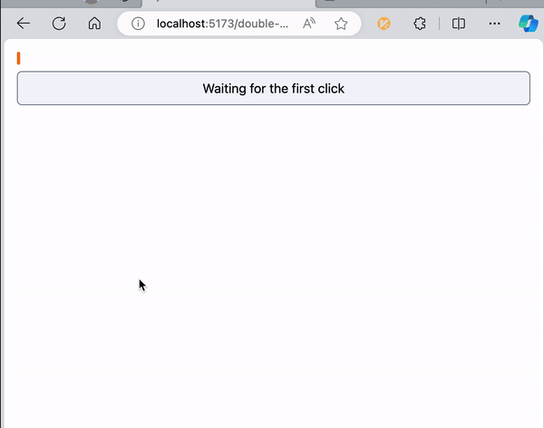

# Double Click Animation

For react

## Preview



## Usage

```ts
const [{ progress, status }, animation] = useDoubleClickAnimation(() => {
  console.log('double click confirmed');
});
```

- Render with `progress` & `status`
- Call `animation.click()` to trigger the animation

Or use `createDoubleClickAnimation` to implement your own hook.
